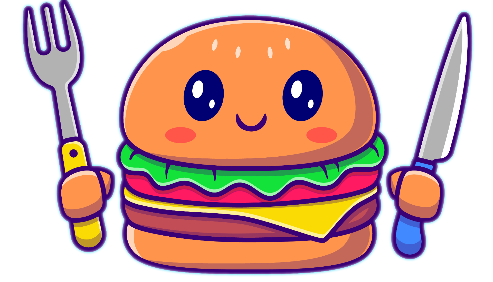

# Find Dining  
A web application that helps users find nearby restaurants.  
 </br>
 
## Specification

Create a web application that allows users to find nearby restaurants.

## Tech

We're using [Next.js](https://nextjs.org/) and [React.js](https://react.dev/) for the frontend and [Strapi](https://strapi.io/) for the backend. Testing was done with [React Testing Library](https://testing-library.com/docs/react-testing-library/intro/) for unit tests and [Cypress](https://www.cypress.io/) for end to end tests. The server is a locally setup [MYSQL server](https://www.mysql.com/). You can configure a database with Strapi [here](https://strapi.io/blog/configuring-strapi-mysql-database). 

## Installation 
1. Clone the repository. 
```
git clone https://github.com/reeceawalsh/Find-Dining
```
2. Install Node.js
```
brew install node
```

## Running The Code 

Start the frontend
```
cd frontend
```
```
npm i
```
```
npm run dev
```
Start the backend
```
cd backend
```
```
npm i
```
```
npm run develop
```
  
## Styling 

If you are writing global css, put it in the globals.css file located in pages.
Global CSS are styles that will be used everywhere, and are not specific to the page you are working on. An example of a global style is ```.blue {
color: blue;
}```
The class blue can now be used everywhere to make font blue.
If you are writing specific css you need to use css modules.
These are css files that are specific to the file you are working on.
They end in module.css.
If I'm working on the login page I would have a css file called login.module.css.
I can import it to the login page by typing 'import styles from './styles/login.module.css' or whatever the path is.
Then I can access the classnames as properties of the styles object e.g. {styles.SubmitButton} (ignore the slashes)

## Before Working Each Time

Always use 'git pull' before working to get the latest version.
Always use 'npm i' to install the latest dependencies.
Always make a separate branch and create a pull request when working.

## Formatting Rules

Components named with Capital Letters (PASCAL CASE) e.g. Component.jsx
Variables are camelCase e.g. firstButton.
Global classes are lower case with dashes e.g. upper-case.
Pages should be named lowercase (for routing purposes).
Components uppercase.

## Folder Structure

Public for images and designs.
Styles are for css files. (If you want to make a css file for each component that is okay.)
Pages store pages.
Components store components.
Lib for helper functions. 
API for backend functions. 
__tests__ for unit tests. 

